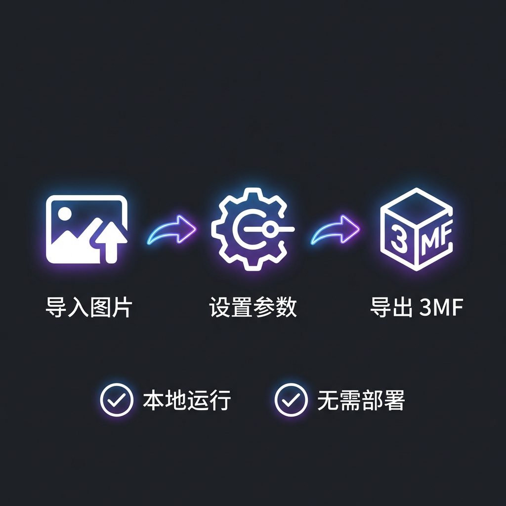

# Forge

[English](README_EN.md) | [中文](README.md)

## 简介

Forge 是一款基于 FDM 的叠色多色打印生成器。它利用 FDM 打印机的半透明线材特性，通过精确计算不同颜色层叠后的色彩混合效果，实现在有限的线材颜色下打印出丰富的色彩表现。

## 特性

*   **本地运行**：基于 PySide 开发，直接本地运行。
*   **无需部署**：无需繁琐部署，开箱即用。

## 下载

请前往 [Releases](../../releases) 页面下载最新的便携包。

## 使用说明

1.  **导入图片**：将需要打印的图片拖入软件。
2.  **设置参数**：配置打印尺寸、层高以及使用的线材颜色。
3.  **生成模型**：点击生成按钮，软件将计算叠色方案并生成对应的 3MF 模型文件。
4.  **切片打印**：将生成的模型导入切片软件进行切片并打印。

## 原理简述

FDM 打印使用的 PLA/PETG 等线材通常具有一定的透光性。通过控制不同颜色线材的层叠顺序和厚度，底层颜色的光线会穿透顶层颜色，从而在视觉上混合出新的色彩。本项目通过算法模拟这种透过混合效果，为目标图像计算出最佳的线材层叠组合。
