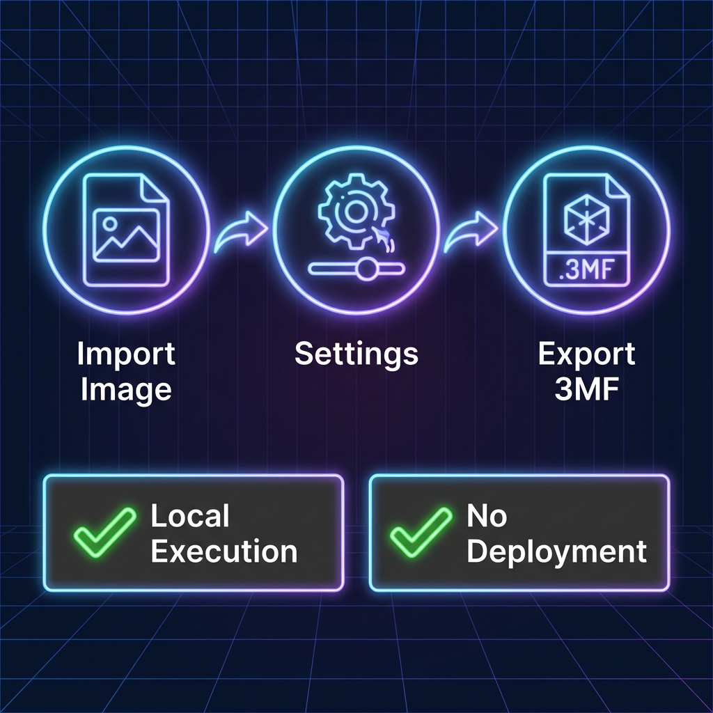

# Forge

[English](README_EN.md) | [中文](README.md)

## Introduction

Forge is an FDM-based multi-color printing generator using color layering. It leverages the translucency of FDM filaments to achieve rich color expression with a limited number of filament colors by precisely calculating the color mixing effects of different layered colors.

## Features

*   **Local Execution**: Built with PySide, runs directly locally.
*   **No Deployment**: Ready to use without any deployment.

## Download

Please visit the [Releases](../../releases) page to download the latest portable package.

## Usage

1.  **Import Image**: Drag and drop the image you want to print into the software.
2.  **Configure Settings**: Set the print size, layer height, and the filament colors to be used.
3.  **Generate Model**: Click the generate button. The software will calculate the color layering scheme and generate the corresponding 3MF model files.
4.  **Slice and Print**: Import the generated model into your slicing software to slice and print.

## Principle

Filaments like PLA/PETG used in FDM printing usually possess some translucency. By controlling the stacking order and thickness of different colored filaments, light from the bottom layers penetrates through the top layers, visually mixing to create new colors. This project uses algorithms to simulate this transmission mixing effect, calculating the optimal filament layering combination for the target image.
